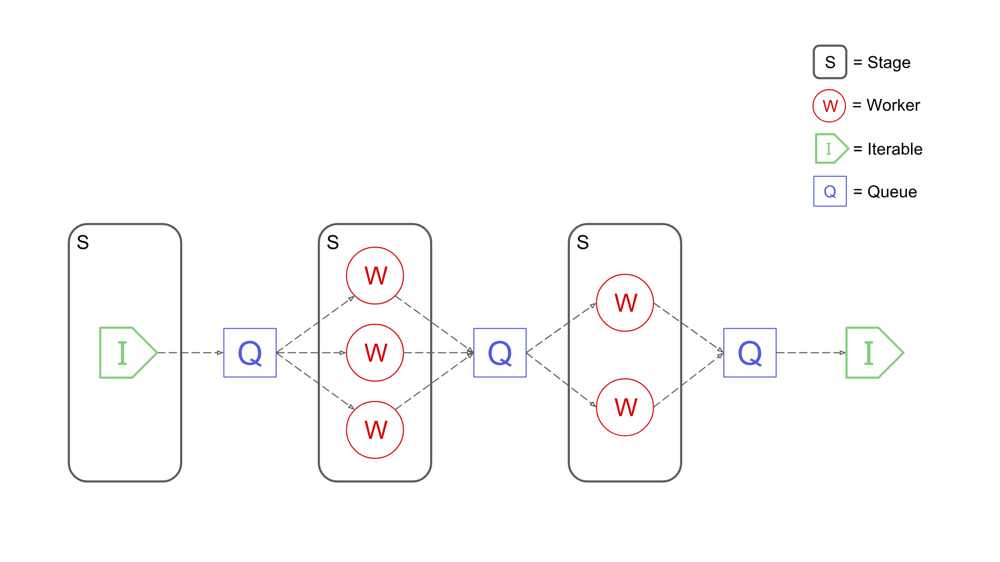

# Advanced Usage

!!! warning
    This document is still a WORK IN PROGRESS

## Architecture
A Pypeln pipeline has the following structure:



* Its composed of several concurrent **stages**
* At each stage it contains on or more **worker** entities that perform a task.
* Related stages are connected by a **queue**, workers from one stage *put* items into it, and workers from the other stage *get* items from it.
* Source stages consume iterables.
* Sink stages can be converted into iterables which 
consume them.

### Stage Types

Pypeln has 3 types of stages, each stage has an associated worker and queue types: 

| Stage Type         | Worker                    | Queue                   |
| ------------------ | ------------------------- | ----------------------- |
| `pl.process.Stage` | `multiprocessing.Process` | `multiprocessing.Queue` |
| `pl.thread.Stage`  | `threading.Thread`        | `queue.Queue`           |
| `pl.task.Stage`    | `asyncio.Task`            | `asyncio.Queue`         |

Depending on the type of stage you use the following characteristics will vary: memory management, concurrency, parallelism, inter-stage communication overhead, worker initialization overhead:


| Stage Type | Memory      | Concurrency  | Parallelism | Communication Overhead | Initialization Overhead |
| ---------- | ----------- | ------------ | ----------- | ---------------------- | ----------------------- |
| `process`  | independent | cpu + IO     | cpu + IO    | high                   | high                    |
| `thread`   | shared      | only for IO  | only for IO | none                   | mid                     |
| `task`     | shared      | optimized IO | only for IO | none                   | low                     |

## Stages
Stages are lazy [iterable](https://docs.python.org/3/glossary.html#term-iterable) objects that only contain meta information about the computation, to actually execute a pipeline you can iterate over it using a for loop, calling `list`, `pl.<module>.run`, etc. For example:

```python
import pypeln as pl
import time
from random import random

def slow_add1(x):
    time.sleep(random()) # <= some slow computation
    return x + 1

data = range(10) # [0, 1, 2, ..., 9]
stage = pl.process.map(slow_add1, data, workers = 3, maxsize = 4)

for x in stage:
    print(x) # e.g. 2, 1, 5, 6, 3, 4, 7, 8, 9, 10
```
This example uses `pl.process` but it works the same for all the other modules. Since `pypeln` implements the `Iterable` interface it becomes very intuitive to use and compatible with most other python code. 

## Workers

!!! warning
    This section is not yet ported correctly

Each Stage defines a number of workers The number of workers on each stage can usually be controled by the `workers` parameter on `pypeln`'s various functions. Try not to create more processes than the number of cores you have on your machine or else they will end up fighting for resources and computation will be suboptimal.

The worker type of this module is a [multiprocessing.Process](https://docs.python.org/3.4/library/multiprocessing.html#multiprocessing.Process). Each worker process is instantiated with `daemon = True`. Creating each process is slow and consumes a lot of memory. Since processes are technically separate programs managed by the OS they are great for doing operations in parallel by avoiding the [GIL](https://realpython.com/python-gil) (or rather having their separate GIL).

## Queues

!!! warning
    This section is not yet ported correctly

The queue type of this module is a [multiprocessing.Queue](https://docs.python.org/3.4/library/multiprocessing.html#multiprocessing.Queue). Since processes don't share memory, all information passed between them through these queues must first be serialized (pickled) which is slow, be aware of this and try to avoid sending large objects.

The number of elements each stage can hold usually be controled by the `maxsize` parameter on `pypeln.process`'s various functions. When passed this parameter sets a maximum size for the input Queue of the stage, this serves as a [backpressure](https://www.quora.com/What-is-backpressure-in-the-context-of-data-streaming) mechanism because any stages pushing data to a Queue that becomes full (reaches its `maxsize`) will have to stop their computation until space becomes available, thus, potentially preveting `OutOfMemeory` errors due to overpressure from faster stages.

## Resource Management

!!! warning
    This section is not yet ported correctly

There are many occasions where you need to create some resource objects (e.g. http or database sessions) that for efficiency are expected to last the whole lifespan of each worker. To handle such objects many functions have the `on_start` and `on_done` arguments which expect some callback functions. 

When a worker is created it calls the `on_start` function, this functions should create and return the resource objects. These object will be passed as extra arguments to the main function and also to the `on_end` function.

```python
import pypeln as pl

def ():
    http_session = get_http_session()
    db_session = get_db_session()
    return http_session, db_session

def on_end(_stage_status, http_session, db_session):
    http_session.close()
    db_session.close()

def f(x, http_session, db_session):
    # some logic
    return y

stage = pl.process.map(f, stage, workers = 3, on_start = on_start)
```

A few notes:

* The resource objects are created per worker.
* `on_start` should return a object other that `None` or a tuple of resource objects.
* If `on_start` returns some arguments then they must be accepted by `f` and `on_end`.
* `on_end` receives a `pypeln.process.StageStatus` object followed by the resource objects created by `on_start`. 


## Pipe Operator

!!! warning
    This section is not yet ported correctly

Functions that accept a `stage` parameter return a `Partial` instead of a new stage when `stage` is not given. These `Partial`s are callables that accept the missing `stage` parameter and return the full output of the original function. For example

    pl.process.map(f, stage, **kwargs) = pl.process.map(f, **kwargs)(stage)

The important thing about partials is that they implement the pipe `|` operator as

    x | partial = partial(x)

This allows you to define pipelines in the following way:

    from pypenl import process as pr

    data = (
        range(10)
        | pl.process.map(slow_add1, workers = 3, maxsize = 4)
        | pl.process.filter(slow_gt3, workers = 2)
        | list
    )

## Recomendations

!!! warning
    This section is not yet ported correctly

Creating processes and doing Inter-Process Communication (IPC) is expensive, therefore we recommend the following:

* Minimize the number of stages based on this module.
* Tune the number of workers based on the number of cores.
* When processing large datasets set the maxsize of the stage to prevent `OutOfMemory` errors.
* If possible don't send large objects.
* If you just need a single stage to perform a task over a collection in parallel use the `pypeln.process.each` function. 

## Async & Task